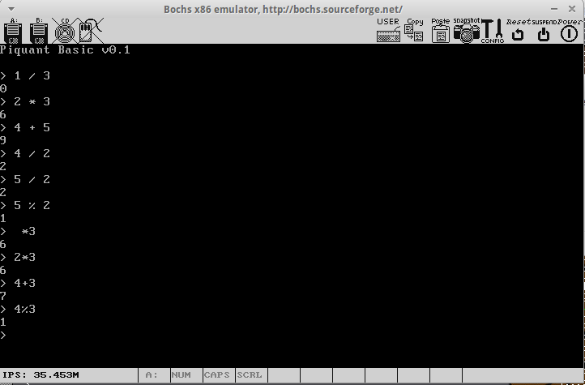

Piquant
====

Piquant is a little toy operating system I'm building.

Why?
=====

Because it's fun. Don't you like to have fun? Ogre.

What does it do?
=====

Right now, not much of anything at all. It boots from a 1.44mB floppy disk, and enters into a BASIC interpreter, just like your favorite home computers of the 70s/80s!

Currently the BASIC only understands simple, 1-digit arithmetic expressions. But this will soon change; I intend to implement at least as many features as uBASIC, maybe QuickBASIC eventually.

How can I run it?
=====

You have to build it to run it. To build it, you need:

* bcc (bruce's c compiler - check your OS's package repositories)
* nasm
* gnu make
* ld86, objdump86, as86

To run it, you can use anything, but the makefile assumes you have 'bochs' installed.

    make clean test

This will rebuild all of the sources and fire up the bochs emulator. Have fun.